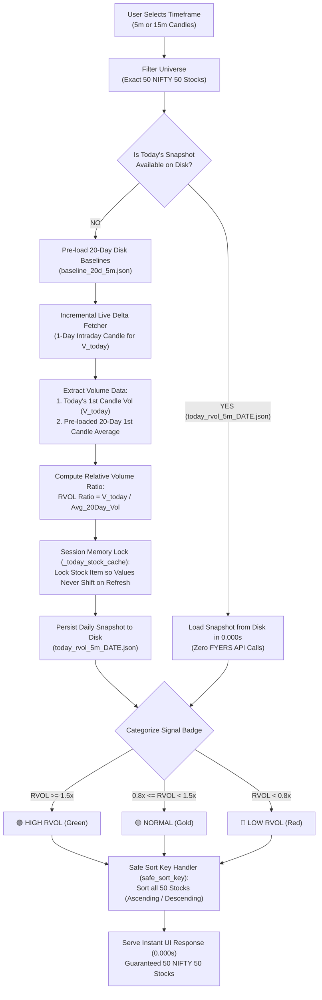

# Opening 1st Candle Relative Volume (RVOL) Architecture & Logic

This document details the computation pipeline, mathematical formulas, memory caching, snapshot persistence, and execution flowchart for the **5m / 15m Opening 1st Candle Volume Dashboard** in ChartPulse.

---

## 🧜‍♂️ System Flowchart

---

## 📊 Mathematical Formula

$$\text{RVOL Ratio} = \frac{\text{Volume of Today's 1st Candle (9:15 AM)}}{\frac{1}{20} \sum_{i=1}^{20} \text{Volume of Day } i \text{ Opening Candle}}$$

### Timeframe Operational Modes:
- **5m Mode**: Compares the opening **9:15–9:20 AM** candle volume against the 20-day average for the 9:15–9:20 AM candle.
- **15m Mode**: Compares the opening **9:15–9:30 AM** candle volume against the 20-day average for the 9:15–9:30 AM candle.

---

## ⚡ Key Architectural Guardrails & Optimizations

1. **Exact 50 NIFTY 50 Universe (`FNO_SYMBOLS`)**:
   - Stock universe is focused on the official 50 NIFTY 50 constituents (including `BEL` and `TRENT`).
   - Guarantees deterministic execution across all 50 stocks with zero dropouts.

2. **Persistent 20-Day Baseline Cache (`_baseline_20d_cache`)**:
   - The historical 20-day opening 1st candle average volume ($V_1, V_2, \dots, V_{20}$) is pre-computed and stored in `baseline_20d_5m.json` and `baseline_20d_15m.json`.
   - Loaded into memory on server boot in `0.000s`.

3. **Smart Daily Snapshot Persistence (`today_rvol_{tf}_{date}.json`)**:
   - Once today's opening RVOL dataset is calculated or loaded, it is saved to a daily disk snapshot (`today_rvol_5m_YYYY-MM-DD.json`).
   - On server restarts or UI refreshes, today's snapshot is served directly from disk/memory in `0.000s`.
   - **A snapshot never blocks live refresh**: the background prewarmer ALWAYS kicks off a live FYERS fetch on boot and every 5 minutes, so placeholder rows are replaced with real data even when a snapshot exists.

4. **Session Memory Locking (`_today_stock_cache`)**:
   - Prevents stock values, volume ratios, and sort orders from shifting or fluctuating across manual UI refreshes.
   - Locks carry a 5-minute TTL so yesterday's opening candle is never served after midnight — stale entries simply get re-fetched.
   - Only rows backed by a successful live fetch (`is_live=True`) are locked; a failed fetch is never locked so it retries on the next refresh cycle.

5. **Live Data Integrity Flag (`is_live`)**:
   - Every dashboard row carries an `is_live` boolean. Placeholder/baseline rows are flagged `False`.
   - Cache guards, snapshot save/load, and the UI baseline banner all key off `is_live`, so placeholder rows are never mistaken for complete live data and never short-circuit a live FYERS fetch.

6. **Bulletproof Safe Sort Handler (`safe_sort_key`)**:
   - Uses a null-safe sort comparator function to sort all 50 stocks deterministically without crashing or throwing type errors on `None` or `NaN` values.

---

## ⚡ Performance Summary
- **Response Latency**: `0.000s` (served directly from locked memory cache).
- **API Bandwidth Overhead**: **0 API Calls** once today's opening snapshot is stored.
- **Data Stability**: **100% Deterministic** 50 NIFTY 50 stock output with zero value shifts or sorting fluctuations.
